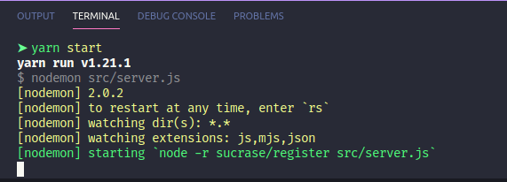

# FastFeet-api
Backend developed for FastFeet app, developed at GoStack bootcamp

## Used Tools

THe folowwing tools were used in this API

* [Node](https://nodejs.org/docs/latest-v12.x/api/)
* [Yarn](https://github.com/yarnpkg/berry)
* [Express](https://expressjs.com/pt-br/)
* [Nodemon](https://nodemon.io)
* [Sucrase](https://github.com/alangpierce/sucrase)
* [DotEnv](https://www.npmjs.com/package/dotenv)
* [Eslint](https://eslint.org)
* [Prettier](https://prettier.io)
* [VSCode](https://code.visualstudio.com/)


First thing you need to do is make sure that you have installed
- [Node.js](https://nodejs.org/docs/latest-v12.x/api/)
- [Yarn](yarnpkg.com/) or [npm](https://www.npmjs.com/)

Then you can clone the repository into your computer using

```git clone https://github.com/jeann47/FastFeet-api```

You can also download as zip package over the interface

Now, in the project folder, run:

```yarn``` or ```npm install``` to download the dependencies.

Then you are ready to go

## Available Scripts

In the project directory, you can run:

### `yarn server`

Runs the app in the development mode.<br />
Use [localhost](http://localhost) and start a [.env](https://blog.rocketseat.com.br/variaveis-ambiente-nodejs/) file following .env.example to set the PORT and all credentials.

if you console show something like
</p>

</p>
means that everything is ok.